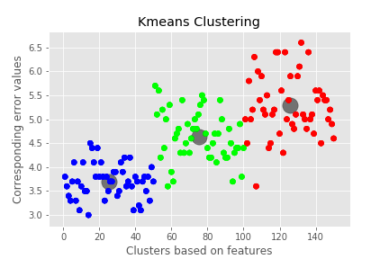

# Unsupervised Machine Learning *using* Cloudmesh Cloud AI Services

 
Mohamed Elfateh Abdelgader, [fa19-516-140](https://github.com/cloudmesh-community/fa19-516-140)

## Introduction  

The main objective of this project is to provide AI capabilities on cloud. mainly I am trying to produce an cloud based method that achieves customer segmentation, which is the practice of grouping customers based on features like age, gender, interests, and spending habits. The developed functionalities will be implemented using cloud platforms mainly two nnodes on chameleon. The scope of work for this deployemnt is to build cababilities on the cloud allows recieving feeds in a data form end users and the service shouls interpret these feeds an responds back results as a segmentation representation of the recieved data, this reponse could be a visualization of the clustered data or tabular representation of the data. 

## Clutering & K-means
In todays world everything we practice as human being in our daily activities is tied to a personalized factor, which has been discovered by our services providers, marketing analyzers or data scientists, customer segmentation is the output of this segregation and binding.

In this project demonstration we will see how segmentation of a product line could be done on a pizza product line simple to segments pieces according to their thickness, width, length and weight in order to be mapped as customers desiring. 

*sample of the dataset*

|ID |piece_length|piece_width|piece_weight|piece_thikness|Pecies|
|---|---|---|---|---|---|
|1|3.8|2.5|1.3|0.12|Pizza-Margreta|
|2|3.6|2.3|1.3|0.12|Pizza-Margreta|
|3|3.4|2.2|1.2|0.12|Pizza-Margreta|
|4|5.6|3.1|4.8|1.42|Pizza - Mashroom|
|5|4.2|4.1|3.9|1.22|Pizza - Mashroom|
|6|5.6|4.3|5.3|2.02|Pizza -Papperoin|
|7|5.4|4.5|5.5|2.32|Pizza -Papperoin|
|8|5.6|3.4|5|2.22|Pizza -Papperoin|

### K-means

Kmeans clustering is one of the powerful Machine learning algorithm practices that defines and discover segmentation according to their patterns by converging in a finite number of iterations with a computational cost considered the most cost effective and efficient one compare to other clustering practices which is representing as:

`0(k*n*d)` 

Where:

* k represents  the umber of clusters.
* n represents  the umber of data points (cutomers, products ..etc).
* d represents  the umber of attributes (length, width, thikness …etc.).

as our practice will be in python lets explore the needed libraries for that, as we can see all of them can be found on the requirements.txt file:

* numpy
* flask
* connexion[swagger-ui]
* scikit-learn

## Technologies Used 

* Python 3.7
* OpenAPI.
* Connexion
* Development manchine is in MacOS 

## Project walking through...

### step 1
*setting up the server [installing requirements.txt]

`sudo -H install -r requirements.txt`

### step 2

#### *Starting the server*

`python3.7 server'api`

##### *Output should look like this:*
	

### step 3
#### *Uploading the file to the server*

`curl -X POST "http://localhost:8080/project" -H "accept: application/json" -H "Content-Type: multipart/form-data" -F "file=@sample.csv;type=text/csv"`

#### *Output should look like this:*

`{
  "filename": "model.csv", 
  "job_id": 0
}`

### step 4

`curl -X POST "http://localhost:8080/project/kmeans" -H "accept: text/csv" -H "Content-Type: application/json"}"
`

#### *response will be an output for the calculation of the kmeans in a plotting chart of clusters rpresenting each cluster associated with its centroid [mainly three clusters and three centroids] as followin:*

 
